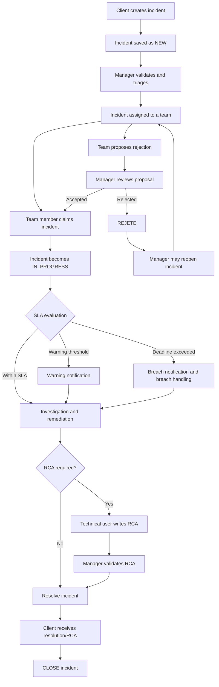
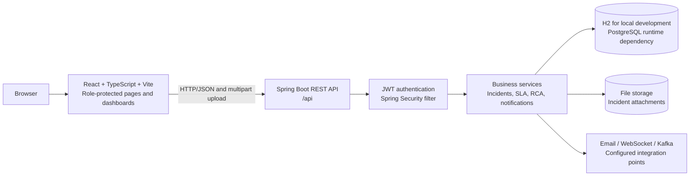
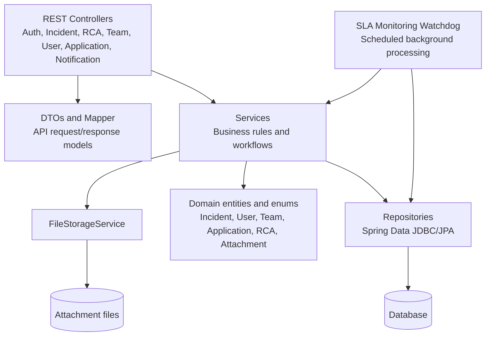

# Sla Incident Management System

Sla Incident Management System is a full-stack web application for registering, assigning, monitoring, resolving, and documenting IT incidents. It provides a shared workspace for clients, incident managers, technical teams, administrators, and responsible treatment officers (`RT`).

This project was developed during my PFA internship at DXC Technology Morocco.

The project is designed around an IT Service Management (ITSM) process: an incident is submitted with its business context and diagnostic evidence, assigned to the right team, monitored against a Service Level Agreement (SLA), resolved with a Root Cause Analysis (RCA), and finally communicated and closed.

## Why this project exists

Traditional ticketing processes can create two operational problems:

1. SLA breaches are detected too late, often only after a customer escalation.
2. Incidents are closed after a quick fix without documenting the real root cause or preventive action.

This application addresses those problems by combining:

- role-based incident workflows;
- severity-based SLA clocks and proactive warnings;
- team assignment and incident claiming;
- file attachments for evidence and diagnostics;
- notifications for important lifecycle events;
- an RCA workflow with manager validation before resolution for governed incidents;
- client visibility into incident progress and RCA reports.

## What the application does

### Incident management

Clients can create incidents associated with an application, describe the issue, select its severity, and upload one or more attachments. Incidents receive a reference and move through a controlled lifecycle.

The main statuses used by the application are:

| Status | Meaning |
| --- | --- |
| `NEW` | Incident has been created and awaits triage. |
| `VALIDATED` | Incident has been accepted and can be assigned. |
| `IN_PROGRESS` | A technical team is investigating or resolving the incident. |
| `RESOLVED` | The solution has been completed and accepted through the resolution workflow. |
| `CLOSED` | The incident lifecycle is finished. |
| `REJETE` | The incident has been rejected, for example because it is outside a team’s scope. |

The rejection workflow allows a technical team to propose rejection with a reason. An incident manager can validate the rejection, reject it directly, review the proposal, or reopen the incident.

### SLA monitoring

The incident level determines the response and resolution expectations. Supported levels are `CRITICAL`, `HIGH`, `MEDIUM`, and `LOW`.

The backend contains an `SlaMonitoringService` that periodically evaluates active incidents. It tracks the remaining time, records warning and breach notifications, and sends alerts when an SLA is close to expiry or has been exceeded. The frontend exposes an SLA clock for operational users and administrators.

SLA values are configurable business rules and should be reviewed before production use. The repository also contains a technical report describing the intended severity-based thresholds and the dual response/resolution clock model.

### RCA governance

An RCA report records:

- the root cause;
- the solution applied;
- preventive measures.

Technical users can create RCA reports. Managers review and validate them, and the report can then be sent to the client. Clients can consult the RCA and reject it with a reason if additional clarification is required.

For incidents subject to the governance rule, manager validation of the RCA is the gate that allows the incident to progress to `RESOLVED`. This makes the platform useful not only for restoring service, but also for preventing recurring incidents.

### Notifications and attachments

Notifications are associated with recipients and lifecycle events such as a new incident, assignment, rejection, resolution, closure, or an approaching/expired SLA. Attachments are uploaded through the client incident endpoint and served through the attachment API.

## User roles

| User | Main responsibilities |
| --- | --- |
| Client | Create incidents, provide evidence, track progress, and review or reject RCA reports. |
| Manager / Incident Manager | Triage incidents, assign teams, review rejections, monitor workload and SLA status, and validate RCA reports. |
| Technical team member / RT | Claim incidents, investigate them, propose rejection when appropriate, implement fixes, and write RCA reports. |
| Administrator | Manage users, teams, applications, and platform configuration. |

The frontend uses the shorter roles `client`, `manager`, `admin`, and `rt`. The backend domain model also contains more explicit ITSM role names such as incident manager, team member, and responsible treatment officer.

## How it works



## Architecture

The project is split into two deployable application parts:

- `frontend`: React and TypeScript single-page application;
- `backend`: Spring Boot REST API and business logic.



### Backend layers



The backend is organized into the following packages:

| Package | Responsibility |
| --- | --- |
| `controller` | Exposes HTTP endpoints under `/api`. |
| `service` | Contains incident, RCA, SLA, notification, team, user, and file-storage rules. |
| `repository` | Persists and queries domain objects. |
| `domain` | Defines entities, roles, statuses, levels, and notification types. |
| `dto` / `mapper` | Separates the API contract from persistence entities. |
| `security` | JWT creation/validation, authentication, and token filtering. |
| `config` | Application startup data and runtime configuration. |
| `exception` | Centralized API error handling. |

### Frontend areas

The frontend routes users to role-specific workspaces:

- `/client/*`: client home, incident creation, tickets, and received RCAs;
- `/manager/*`: incident workspace, RCA inbox, and SLA clock;
- `/admin/*`: application, team, SLA, and settings administration;
- `/rt/*`: treatment workspace, incident details, RCA authoring, and SLA clock;
- `/login`: authentication.

The API client in `frontend/src/lib/api.ts` handles communication with the backend. Authentication state and role-based navigation are handled by the frontend auth/session modules and protected routes in `frontend/src/App.tsx`.

## Main API areas

The backend is mounted with the `/api` servlet prefix. The principal resource groups are:

| Resource | Examples |
| --- | --- |
| Authentication | `POST /api/auth/login` |
| Incidents | `GET/POST/PUT /api/incidents`, claim, rejection, review, and reopen actions |
| RCA reports | `GET/POST/PUT /api/rca-reports`, validation and client delivery actions |
| Teams | `/api/teams` and team member lookup |
| Users | `/api/users` |
| Applications | `/api/applications` |
| Notifications | `/api/notifications` |
| Attachments | `GET /api/attachments/{id}/file` |

## Technology stack

### Backend

- Java 17
- Spring Boot 4
- Spring MVC
- Spring Security and JWT
- Spring Data JDBC and JPA
- Spring Validation
- H2 for local development
- PostgreSQL runtime dependency
- Spring Mail, WebSocket, Kafka, and Actuator dependencies
- Maven

### Frontend

- React 19
- TypeScript
- Vite
- React Router
- Tailwind CSS
- Framer Motion
- Lucide React
- Recharts
- Mermaid and React Flow support for diagrams/visualizations

## Local development

### Backend

```powershell
cd backend
./mvnw spring-boot:run
```

If the Maven wrapper is not present, use an installed Maven version:

```powershell
mvn spring-boot:run
```

The API is available at `http://localhost:8080/api`.

### Frontend

```powershell
cd frontend
npm install
npm run dev
```

The Vite development server normally runs at `http://localhost:5173`. The frontend reads `VITE_API_BASE_URL`; when it is not set, it defaults to `http://localhost:8080/api`.

### Configuration note

The current application properties are development-oriented. Before deploying the application, move passwords, JWT secrets, database credentials, CORS origins, and file-storage paths to environment variables or a secret-management system. Do not commit real credentials to source control.

## Repository structure

```text
.
+-- backend/
|   +-- src/main/java/com/entreprise/incidentmanagement/
|   |   +-- controller/
|   |   +-- config/
|   |   +-- domain/
|   |   +-- dto/
|   |   +-- exception/
|   |   +-- mapper/
|   |   +-- repository/
|   |   +-- security/
|   |   `-- service/
|   `-- pom.xml
+-- frontend/
|   +-- src/
|   |   +-- components/
|   |   +-- lib/
|   |   `-- pages/
|   +-- package.json
|   `-- vite.config.ts
+-- uploads/

```
